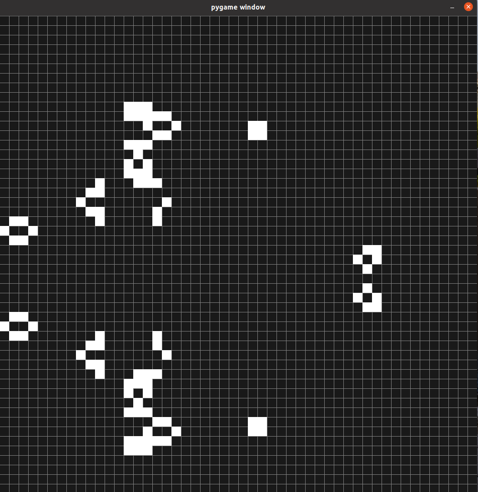

# The Game of Life 

Here's my attempt to recreate the game of life using pygame

# Quick start 

Install the requirements 

    pip install -r requirements.txt
    
For those of you which are using Ubuntu for installing pygame run the following command:

    sudo apt-get install python-pygame

Run the game

    python main.py
    
# Controllers

- **Return key** to start the game after you draw the points on the suface
- **Space** to Pause the game 
    

# Author

Paolo D'Elia

# License

MIT